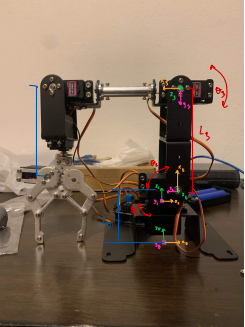
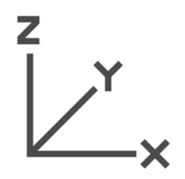

# Robot5DOF — Python GUI Controller

Control software for a 5-DOF (degree-of-freedom) robotic arm: forward/inverse kinematics, a Tkinter GUI for jogging (MOVE_J) and linear motion (MOVE_L), Arduino firmware for servo control, and MATLAB scripts (RRT path planning) used for trajectory research.

## Repo layout

```
python_gui/     Tkinter GUI + kinematics (entry point: UI_for_robot.py)
arduino/        Arduino firmware (servo control, serial commands)
matlab/         MATLAB path-planning scripts + RVC/Robotics Toolbox (rvctools)
docs/images/    Reference diagrams (MOVE_J, MOVE_L)
```

## Python GUI

### Setup

```bash
cd python_gui
pip install -r requirements.txt
cp .env.example .env   # fill in your DB credentials
```

`.env` variables (used by `database.py`):

```
DB_HOST=...
DB_NAME=industrial_robot
DB_USER=...
DB_PASSWORD=...
```

### Run

```bash
python UI_for_robot.py
```

Files:
- `UI_for_robot.py` — main GUI (MOVE_L, MOVE_J, inverse-transform panels), talks to the arm over serial (`pyserial`).
- `Foward_kinematic.py` / `Inverse_kinematic.py` — DH-parameter based forward/inverse kinematics for the 5-DOF arm.
- `moveL.py` — linear (Cartesian) move trajectory generation.
- `velocity_cal.py` — joint velocity calculation between two poses.
- `database.py` — MySQL connection decorator (reads credentials from `.env`, never hardcode them).

## Arduino firmware

`arduino/RobotMove_arduino.ino` — drives 5 servos (`Servo` library) from serial commands sent by the Python GUI.

## MATLAB

`matlab/scripts/` — RRT 3D path planning (`RRTPath3D.m`, `PathObjtive3D.m`, `SolvePath_DE.m`, `GenProblem.m`) and misc robot model scripts (`robot_matlab.m`).

`matlab/rvctools/` — vendored [Robotics Toolbox for MATLAB (RVC)](https://petercorke.com/toolboxes/robotics-toolbox/) dependency. Run `startup_rvc.m` to add it to your MATLAB path before running scripts in `matlab/scripts/`.

## Reference diagrams




## Notes

- MySQL credentials must go through `.env` (`python_gui/.env.example` has the template) — do not commit real credentials.
- `matlab/rvctools/RTB.mltbx` is a large (~26MB) vendored toolbox installer; kept in-repo for convenience.
