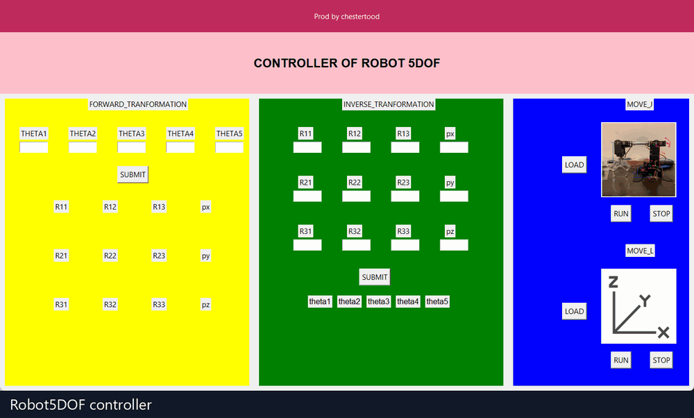
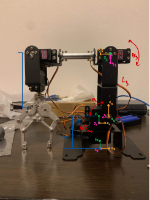
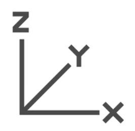

# Robot5DOF

Control a 5-DOF robotic arm from your desktop — type joint angles, get the end-effector pose; type a pose, get the joint angles; send it to the arm over serial.

[](docs/media/demo.gif)


## Features

- **Forward kinematics** — enter THETA1–5, get the 4×4 pose (rotation R11–R33 + position px, py, pz).
- **Inverse kinematics** — enter a pose, get THETA1–5 back (closed-form solution for this arm).
- **MOVE_J** — joint-space move: load the last solved angles and run them on the arm.
- **MOVE_L** — straight-line (Cartesian) move interpolated in 100 steps, each step solved with inverse kinematics.
- **Serial link** — angles are streamed to an Arduino that drives the 5 servos.
- **History** — every submitted pose and its angles are logged to MySQL.
- **Path planning** — MATLAB RRT 3D scripts used for trajectory research.

## How it works

Enter angles → **SUBMIT** → forward kinematics → pose. Enter a pose → **SUBMIT** → inverse kinematics → angles. **LOAD** reads the latest row from MySQL, **RUN** streams `theta1,theta2,theta3,theta4,theta5` lines to the Arduino at 9600 baud.

The demo above shows the round trip: `30, 45, 60, 30, 0` → pose → the same five angles back.

## Quick start

### Requirements

- Python 3.12 (with Tkinter), Windows
- MySQL server (only for SUBMIT logging / LOAD)
- Arduino with 5 servos on `COM3` (optional — without a board the GUI still runs and just prints what it would send)

### Run

```bash
cd python_gui
pip install -r requirements.txt
cp .env.example .env     # fill in your DB credentials
python UI_for_robot.py
```

`.env` (read by `database.py`, never commit real credentials):

```
DB_HOST=...
DB_NAME=industrial_robot
DB_USER=...
DB_PASSWORD=...
```

The GUI expects a table `tranformation_metrix` with columns `r11…r33, px, py, pz, THETA1…THETA5`.

### Arduino

Open `arduino/RobotMove_arduino.ino` in the Arduino IDE, upload it, and make sure the board shows up as `COM3` (change the port in `UI_for_robot.py` otherwise).

### MATLAB

Run `matlab/rvctools/startup_rvc.m` once to add the vendored Robotics Toolbox to the path, then run the scripts in `matlab/scripts/`.

### Re-record the demo GIF

```bash
python docs/media/record_demo.py
```

Drives the real GUI, stubs MySQL and the Arduino, and rewrites `docs/media/demo.gif` (Windows, needs a visible screen).

## Project layout

```
python_gui/     Tkinter GUI + kinematics (entry point: UI_for_robot.py)
arduino/        Servo firmware (serial commands)
matlab/         RRT path planning + vendored Robotics Toolbox (rvctools)
docs/media/     demo.gif + script that records it
docs/images/    MOVE_J / MOVE_L reference diagrams
```

| File | What it does |
|------|--------------|
| `UI_for_robot.py` | Main GUI: forward / inverse panels, MOVE_J, MOVE_L, serial |
| `Foward_kinematic.py` | DH-parameter forward kinematics |
| `Inverse_kinematic.py` | Closed-form inverse kinematics |
| `moveL.py` | Linear-move trajectory generation |
| `velocity_cal.py` | Joint velocity between two poses |
| `database.py` | MySQL connection decorator (credentials from `.env`) |

## Reference diagrams




## Notes

- `matlab/rvctools/RTB.mltbx` is a large (~26 MB) vendored installer, kept in-repo for convenience.
